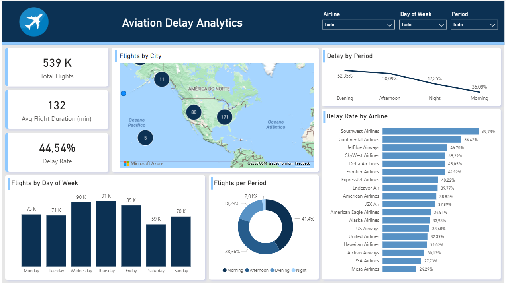

# ✈️ Aviation Delay Analytics Pipeline

An end-to-end Data Engineering project built on Microsoft Azure, 
demonstrating a modern ELT pipeline using real-world aviation delay data.



---

## Architecture
Sources          Transform       Storage              Warehouse      BI
--------         ---------       -------              ---------      --
CSV (ERP)   -->              --> Azure Data Lake   --> Azure SQL --> Power BI
SQL Server  --> Python+Pandas --> Bronze/Silver/Gold   Star Schema    Dashboard
JSON Sensors-->              --> ADLS Gen2          
                                      |
                             Azure Data Factory
                             (Orchestration)
                             
Azure Data Factory orchestrates the full pipeline

---

## 🛠️ Tech Stack

| Layer | Technology |
|-------|-----------|
| Programming | Python + Pandas |
| Source DB | SQL Server (Docker) |
| Cloud Storage | Azure Data Lake Storage Gen2 |
| Orchestration | Azure Data Factory |
| Data Warehouse | Azure SQL Database |
| Data Modelling | Star Schema (1 fact + 5 dims) |
| BI & Reporting | Microsoft Power BI |
| Containerisation | Docker |
| Version Control | GitHub |

---

## Data Sources

| Source | Format | Description |
|--------|--------|-------------|
| Airlines Dataset (Kaggle) | CSV | 539,383 historical flights |
| Airport Reference DB | SQL Server | 872 airports with coordinates |
| Operational Sensors | JSON | Simulated weather & gate data |

---

## Star Schema
+-------------+
                    |  dim_day    |
                    +-------------+
                          |
+-------------+    +-------------+    +-------------+
| dim_airline |----| fact_flights |----|  dim_time   |
+-------------+    +-------------+    +-------------+
                    |           |
+-------------+    |    +-------------+
| dim_airport |----+    | dim_weather  |
+-------------+         +-------------+

fact_flights (539,379 rows) -- central table
dim_airline  (18 rows)      -- airline details + alliance
dim_airport  (872 rows)     -- airport coords for map
dim_day      (7 rows)       -- day name + weekend flag
dim_time     (24 rows)      -- hour + period of day
dim_weather  (360 rows)     -- simulated sensor data

**fact_flights** — 539,379 rows, one per flight
**dim_airline** — 18 airlines with alliance info
**dim_airport** — 872 airports with lat/long for map
**dim_day** — 7 days with weekend flag
**dim_time** — 24 hours with period classification
**dim_weather** — Simulated sensor readings per airport/hour

---

## Key Insights

- **44.5%** overall delay rate across all flights
- **Southwest Airlines** has the highest delay rate at **69.8%**
- **Mesa Airlines** is the most punctual at **24.3%**
- **Wednesday and Thursday** are the busiest days
- **Morning flights** have the lowest delay rate at **36%**
- **Evening flights** have the highest delay rate at **52%**

---

## How to Run

### Prerequisites
- Python 3.x
- Docker Desktop
- Azure account
- Power BI Desktop

### 1. Clone the repository
```bash
git clone https://github.com/your-username/aviation-delay-pipeline.git
cd aviation-delay-pipeline
```

### 2. Install dependencies
```bash
pip install -r requirements.txt
```

### 3. Start SQL Server
```bash
docker run -e "ACCEPT_EULA=Y" -e "SA_PASSWORD=Aviation2024!" \
  -p 1433:1433 --name aviation_sqlserver \
  -d mcr.microsoft.com/mssql/server:2022-latest
```

### 4. Run the pipeline
```bash
python python/setup_sqlserver.py
python python/populate_airports.py
python python/populate_airlines.py
python python/generate_sensors.py
python python/transform.py
python python/upload_to_azure.py
python python/load_to_dw_fast.py
```

### 5. Open Power BI
Connect to Azure SQL Database and open `powerbi/aviation_dashboard.pbix`

---

## Project Structure
aviation-delay-pipeline/
├── python/
│   ├── extract.py
│   ├── transform.py
│   ├── load_to_dw_fast.py
│   ├── upload_to_azure.py
│   ├── generate_sensors.py
│   ├── populate_airports.py
│   └── populate_airlines.py
├── sql/
│   └── create_dw_tables.py
├── docs/
│   └── architecture.md
├── data/          # Not tracked in git
│   ├── raw/
│   ├── curated/
│   └── staging/
└── README.md

---

## Architecture Decisions

**Why ELT over ETL?**
Cloud storage is cheap and compute is elastic, loading raw data first and transforming in the cloud is more flexible and allows reprocessing.

**Why Star Schema?**
Optimised for analytical queries and Power BI performs significantly better with star schemas than normalised models.

**Why Parquet?**
Columnar storage — 5-10x faster for analytical queries, 70% smaller than CSV, preserves data types.

**Why simulate MQTT sensors?**
In production, operational sensor data would arrive via MQTT brokers. The simulation demonstrates the integration pattern without requiring physical infrastructure.

---

## 👤 Author

**Fábio Reis**
[LinkedIn](https://www.linkedin.com/in/f%C3%A1bio-reis-6570833a2/)

---

*Dataset: [Airlines Delay — Kaggle](https://www.kaggle.com/datasets/jimschacko/airlines-dataset-to-predict-a-delay)*
